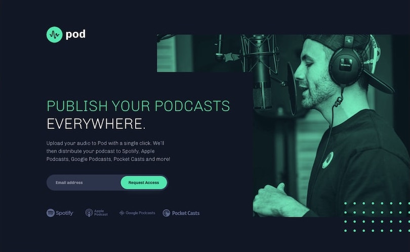

# Pod Request Access Landing Page


<div align="center">

  A Full Responsive Landing Page < br > Responsive for all devices, built using HTML, CSS, and JavaScript.

  <a href="https://access-pod-request.netlify.app/"><strong>➥ Live Demo</strong></a>

</div>

<br />


### Demo ScreenShots



Pod Request Landing Page Demo

### Prerequisites

Before you begin ensure you have met the following requirements: 

- [Git](https://git-scm.com/) must be installed in your operating system.
- [Node](https://nodejs.org/en/) must be installed in your operating system.

### Run Locally

To run interactive ratings component locally run this command on your git bash/terminal

Linux and MacOs 

```bash
sudo git clone https://github.com/stephenikuomola/pod-request-access-landing-page.git

npm install

npm run start
```

Windows

```bash
git clone https://github.com/stephenikuomola/pod-request-access-landing-page.git

npm install 

npm run start
```

### Contact

If you want to contact me you can reach me at [Twitter](https://twitter.com/stephenikuomola) or [LinkedIn](https://www.linkedin.com/in/ikuomola-stephen/) or [FrontEndMentor](https://www.frontendmentor.io/profile/stephenikuomola)

### License

This project is free to use and does not contain any license
